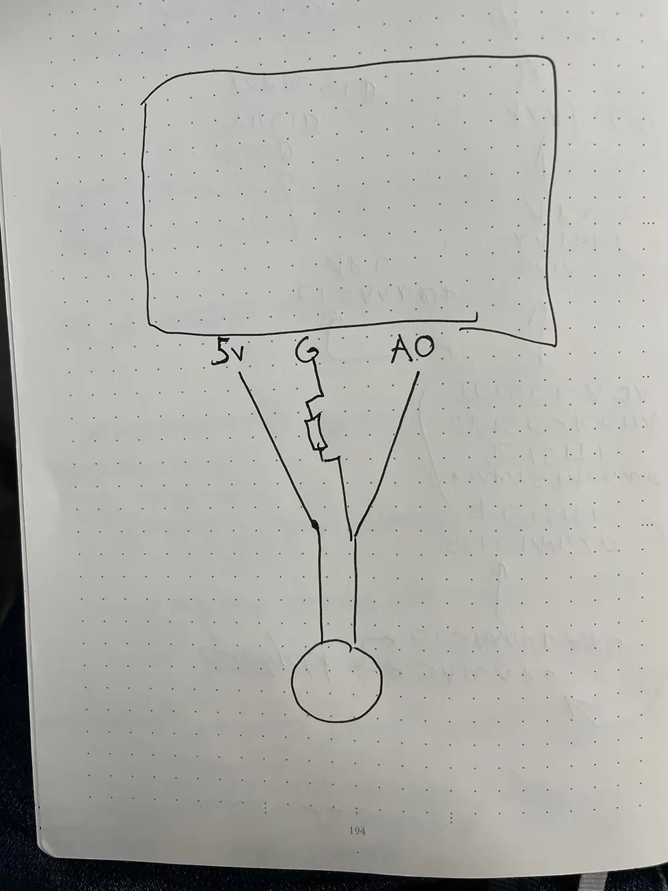
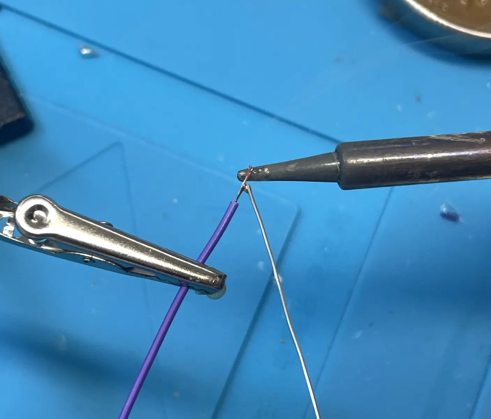
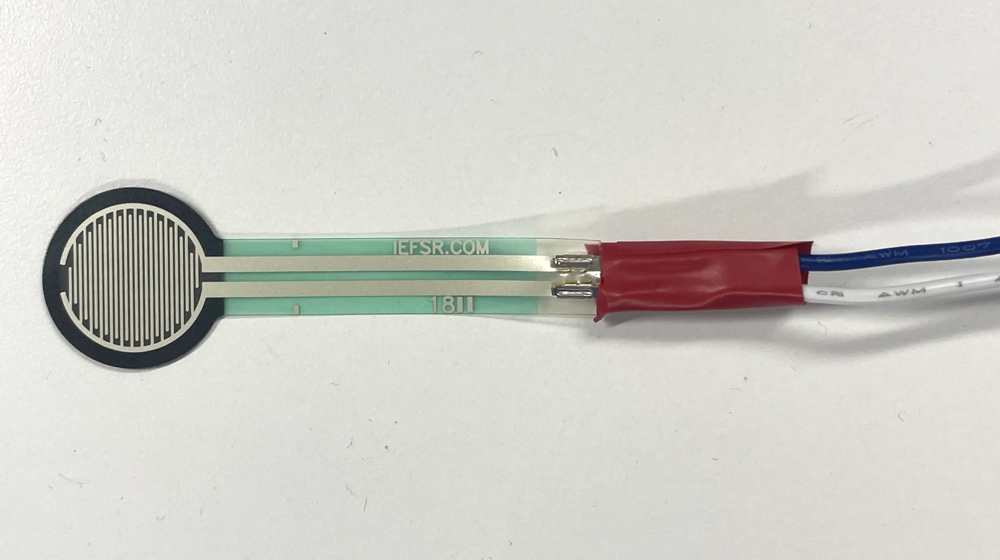
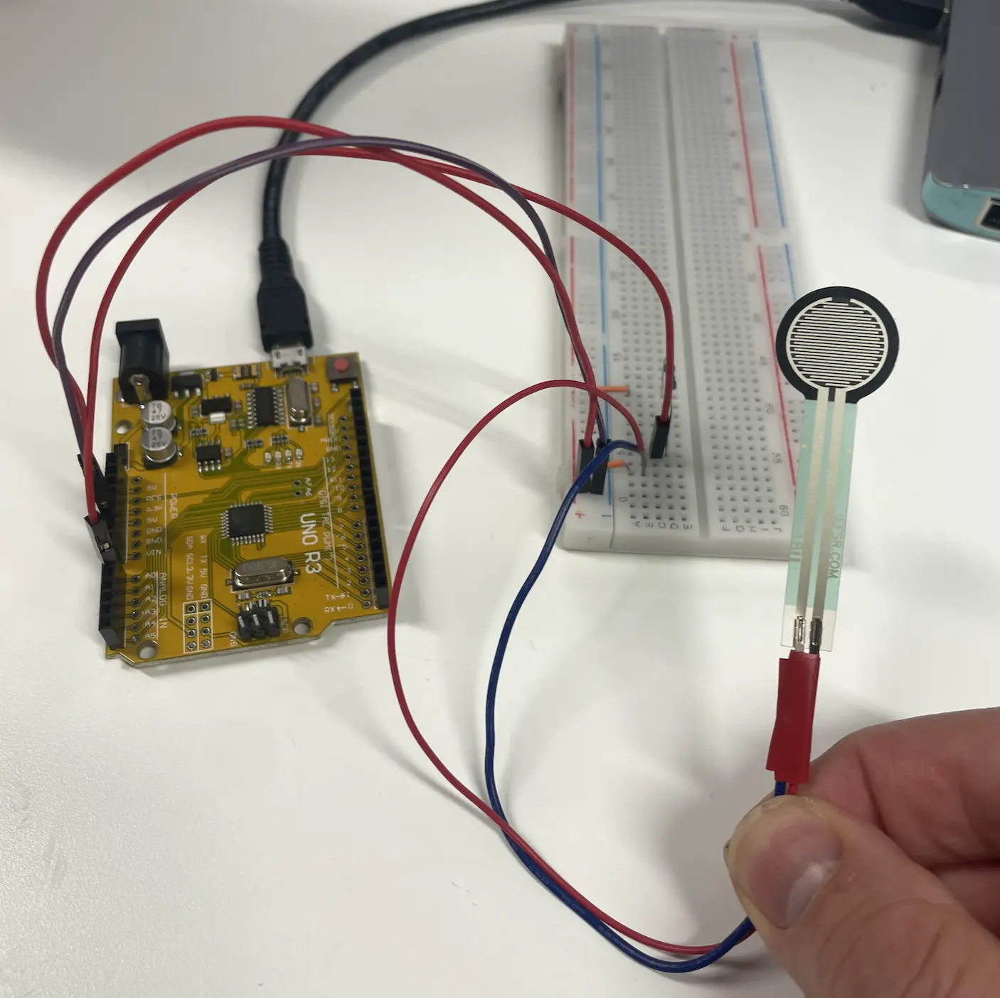
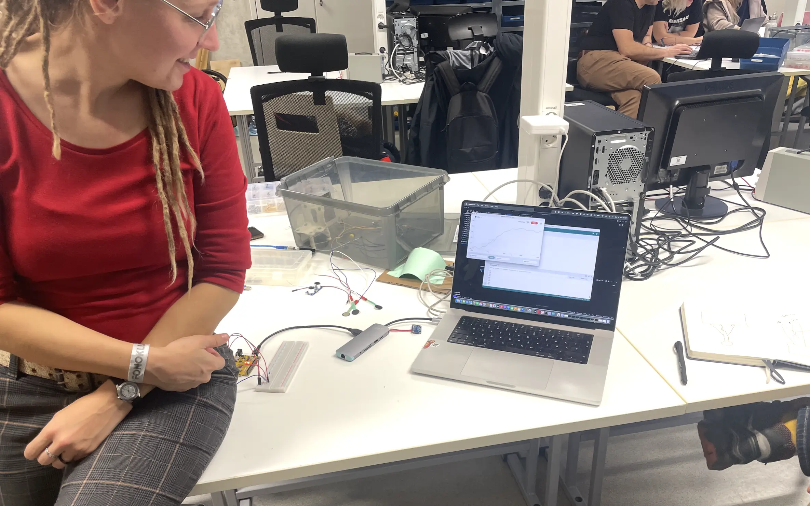
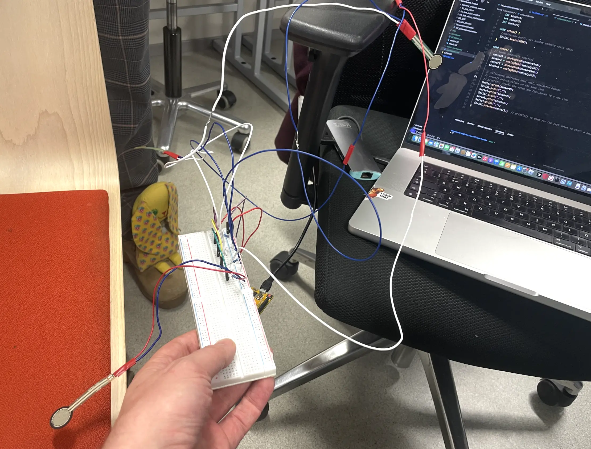

# Närvilised-toolid
TLU magistri raames tootedisainis Arduinoga tehtud katsetused

# Arduino IDE käivitamise juhend Mac OS-i jaoks
MacOS-is saad Arduino ühenduse kontrollimiseks kasutada järgmist juhist:
1.	Ühenda Arduino arvutiga USB-kaabli abil.
2.	Kontrolli ühendatud seadmeid: Sisesta terminali järgmine käsk, et näha kõiki ühendatud USB-seadmeid: `ls /dev/tty.*`

See käsk loetleb kõik seriaalpordid. Tulemuses peaksid olema näha nimed nagu `/dev/tty.usbmodemXXXX` või `/dev/tty.usbserialXXXX`, mis on Arduinole omased. (XXXX tähistab juhuslikke tähemärke, mis võivad varieeruda.)

4.	Alternatiivne viis - Arduino IDE kaudu:
    •	Ava Arduino IDE (kui see pole veel paigaldatud, saad selle Arduino ametlikult lehelt alla laadida).
    •	Mine menüüsse Tools > Port ja otsi USB-pordi nime (nt `/dev/tty.usbmodemXXXX`). Kui näed nimekirjas sellist porti, on Arduino ühendatud.

Kui Arduino ei ilmu pordiloendisse, veendu, et USB-kaabel töötab korralikult ja vajadusel installi FTDI või CH340 draiverid, sõltuvalt Arduinost (mõni kloon võib neid vajada).

Viimase Mac OS-i versiooni jaoks ei olnud CH340 draiverit vaja installida. Seega tasub kõigepealt testida, kas töötab. Kui ei tööta, siis üks võimalik variant draiveri installiks: https://sparks.gogo.co.nz/ch340.html või see https://www.cytron.io/tutorial/CH340_MacOS

## Seadmete seadistamine
- Surveanduri Arduino plaadiga ühendamise skeem:

- Jootsime surveanduritele juhtmed:

- Joodetud juhtmetega surveandur:

- Arduinoga ühendatud surveandur:

- Persetest:

- Töötav tool:

### Surveanduri parameetrid
Mida me teada tahame – kui palju erineb kahe anduri surveväärtus. Kui see on stabiilselt erinev, siis järelikult istub istuja viltu, kui see aga muutub sagedasti, siis järelikult istuja niheleb.